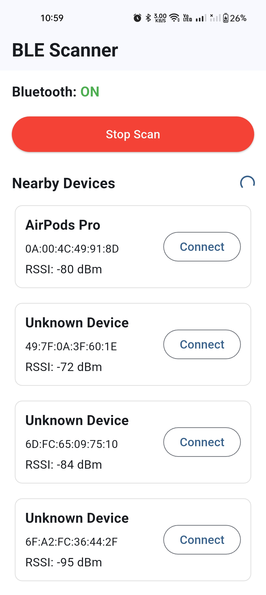
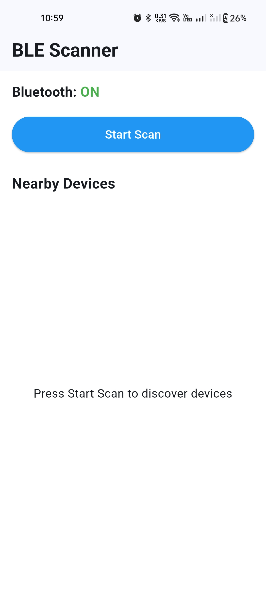
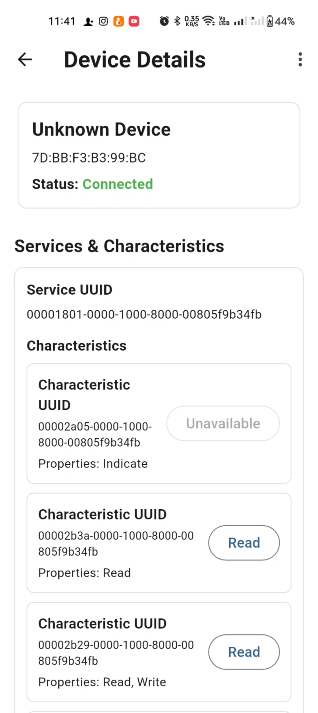
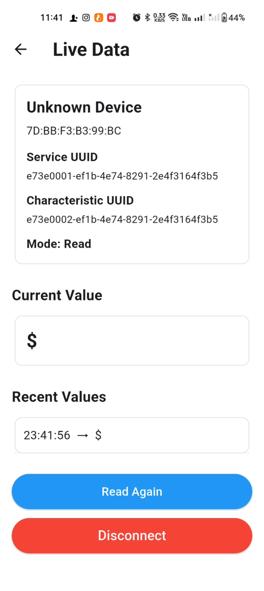
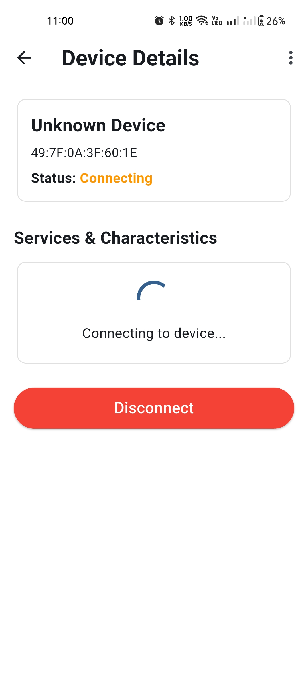

# BLE Vitals Scanner

A Flutter application that scans nearby Bluetooth Low Energy (BLE) devices, connects to a selected device, discovers its available services and characteristics, and displays live values from readable or notifiable characteristics.

This project was built as part of the Flutter Intern Assignment: BLE Vitals Scanner.

---

## Overview

BLE Vitals Scanner focuses on the core BLE workflow:

Scan nearby BLE devices, connect to a selected peripheral, discover GATT services and characteristics, then read or subscribe to characteristic values in real time.

The application was intentionally designed with a simple and clean UI so the main focus remains on BLE logic, state handling, connection flow, and error handling.

---

## Screenshots

<table>
  <tr>
    <td align="center">
      <strong>Scan Screen</strong> 
      
    </td>
    <td align="center">
      <strong>Nearby Devices</strong> 
      
    </td>
    <td align="center">
      <strong>Device Details</strong> 
      
    </td>
  </tr>
  <tr>
    <td align="center">
      <strong>Services & Characteristics</strong> 
      
    </td>
    <td align="center">
      <strong>Live Data</strong> 
      
    </td>
    <td align="center">
      <strong>Disconnect Flow</strong> 
      
    </td>
  </tr>
</table>

---

## Features

- Request Bluetooth permissions on Android
- Scan nearby BLE devices in real time
- Display discovered devices with:
  - Device name
  - Device ID
  - RSSI value
- Connect to a selected BLE device
- Show live connection status:
  - Connecting
  - Connected
  - Disconnecting
  - Disconnected
- Discover available BLE services
- Display characteristics for each service
- Show characteristic properties:
  - Read
  - Notify
  - Write
  - Indicate
- Read values from readable characteristics
- Subscribe to notifiable characteristics
- Display latest received value
- Display recent received values with timestamps
- Stop live stream
- Disconnect and return to scanning
- Handle connection timeout and common BLE errors

---

## Tech Stack

- Flutter
- Dart
- flutter_reactive_ble
- permission_handler
- provider

---

## BLE Package Constraint

All BLE-related functionality in this project is implemented using:

    flutter_reactive_ble

The app uses flutter_reactive_ble for:

- Scanning BLE devices
- Connecting to BLE peripherals
- Discovering services
- Reading characteristics
- Subscribing to characteristic notifications
- Handling connection status updates

No other BLE package is used for BLE functionality.

---

## Project Structure

    lib/
    ├── core/
    │   └── permissions/
    │       └── ble_permission_service.dart
    │
    ├── features/
    │   └── ble/
    │       ├── data/
    │       │   └── ble_repository.dart
    │       └── provider/
    │           └── ble_provider.dart
    │
    ├── screens/
    │   ├── scan_screen/
    │   │   └── scan_screen.dart
    │   ├── device_details_screen/
    │   │   └── device_details_screen.dart
    │   └── live_data_screen/
    │       └── live_data_screen.dart
    │
    └── main.dart

---

## Architecture Overview

The project follows a simple layered architecture.

### Presentation Layer

Responsible for UI screens and user interaction.

Screens:

- ScanScreen
- DeviceDetailsScreen
- LiveDataScreen

### State Management Layer

Implemented using Provider and ChangeNotifier.

Main state class:

    BleProvider

Responsibilities:

- Manage scanning state
- Store discovered devices
- Manage connection status
- Store discovered services and characteristics
- Manage live values
- Handle disconnect and reconnect flow
- Expose error messages to the UI

### Data Layer

Implemented in:

    BleRepository

Responsibilities:

- Use flutter_reactive_ble
- Start BLE scan
- Connect to a selected device
- Discover services
- Read characteristics
- Subscribe to characteristics

### Permission Layer

Implemented in:

    BlePermissionService

Responsibilities:

- Request Bluetooth permissions
- Request location permission where required by Android versions

---

## App Flow

    Open App
       ↓
    Request Bluetooth Permissions
       ↓
    Start BLE Scan
       ↓
    Show Nearby Devices
       ↓
    Select Device
       ↓
    Connect to Device
       ↓
    Discover Services and Characteristics
       ↓
    Read / Subscribe to Characteristic
       ↓
    Display Live Data
       ↓
    Disconnect
       ↓
    Return to Scan Screen

---

## Setup Instructions

### 1. Clone the repository

    git clone https://github.com/YOUR_USERNAME/ble_vitals_scanner.git
    cd ble_vitals_scanner

Replace YOUR_USERNAME with your GitHub username.

### 2. Install dependencies

    flutter pub get

### 3. Connect an Android device

A real Android device is recommended because BLE scanning and connection are not reliable on emulators.

### 4. Run the app

    flutter run

---

## Android Permissions

The app requires Bluetooth permissions for BLE scanning and connection.

The Android manifest includes permissions for:

    <uses-permission android:name="android.permission.BLUETOOTH" android:maxSdkVersion="30" />
    <uses-permission android:name="android.permission.BLUETOOTH_ADMIN" android:maxSdkVersion="30" />

    <uses-permission
        android:name="android.permission.BLUETOOTH_SCAN"
        android:usesPermissionFlags="neverForLocation" />

    <uses-permission android:name="android.permission.BLUETOOTH_CONNECT" />

    <uses-permission android:name="android.permission.ACCESS_FINE_LOCATION" android:maxSdkVersion="30" />
    <uses-permission android:name="android.permission.ACCESS_COARSE_LOCATION" android:maxSdkVersion="30" />

    <uses-feature
        android:name="android.hardware.bluetooth_le"
        android:required="true" />

Runtime permissions are requested using:

    permission_handler

---

## Testing

The app was tested using a BLE peripheral simulator created with nRF Connect on another Android device.

### Testing Setup

Device 1:

    Flutter app installed
    Acts as BLE Central / Scanner

Device 2:

    nRF Connect installed
    Acts as BLE Peripheral / Advertiser / GATT Server

### nRF Connect Setup

A test GATT server was created with:

    Service:
    Heart Rate Service
    UUID: 0000180D-0000-1000-8000-00805F9B34FB

    Characteristic:
    Heart Rate Measurement
    UUID: 00002A37-0000-1000-8000-00805F9B34FB

    Properties:
    Read
    Notify

The advertiser was configured as:

    Advertising Type: Legacy
    Connectable: Enabled
    Scannable: Enabled
    Device Name: Enabled

---

## Main Screens

### Scan Screen

The scan screen allows the user to:

- Start scanning
- Stop scanning
- View nearby BLE devices
- Select a device to connect

Each discovered device displays:

    Device Name
    Device ID
    RSSI

If a device has no name, it is displayed as:

    Unknown BLE Device

### Device Details Screen

The device details screen displays:

- Device name
- Device ID
- Connection status
- Available services
- Available characteristics
- Characteristic properties

The app automatically discovers services after a successful connection.

### Live Data Screen

The live data screen displays:

- Selected service UUID
- Selected characteristic UUID
- Read or Subscribe mode
- Latest value
- Recent values
- Stop live stream button
- Disconnect button

---

## Error Handling

The app handles several BLE-related cases.

### Permission Denied

If Bluetooth permissions are denied, the app shows:

    Bluetooth permissions are required

### Connection Timeout

If a device does not complete connection within the expected time, the app shows:

    Connection timeout. Make sure the selected device is connectable.

### Device Disconnected

If the connection is lost, the app updates the connection state and clears related BLE data.

### No Services Found

If no GATT services are discovered, the app shows:

    No services discovered.

### No Live Value Received

If no characteristic data is received yet, the app shows:

    No value received yet

---

## Issues Faced and Solutions

### Some BLE devices appear but do not connect

Some devices, such as commercial earbuds or unknown BLE advertisers, may appear during scanning but may not expose connectable GATT services to third-party apps.

Solution:

- Test with a connectable BLE peripheral
- Use nRF Connect as a GATT server
- Prefer devices with strong RSSI values
- Show timeout errors clearly in the UI

### Android BLE stack may delay disconnection

After disconnecting, reconnecting immediately may fail on some Android devices because the BLE stack needs a short time to release GATT resources.

Solution:

- Added clean disconnect handling
- Cancelled active subscriptions
- Cancelled connection stream
- Added a short delay after disconnect
- Disabled reconnect actions while disconnecting

### Some Android devices do not support advanced advertising

Some phones do not support Extended Advertising or Periodic Advertising.

Solution:

- Used Legacy Advertising in nRF Connect
- Used Connectable Advertising
- Added a standard GATT service and characteristic

### Devices may appear as Unknown

Some BLE peripherals do not advertise a readable local name.

Solution:

- Display fallback name:

  Unknown BLE Device

- Use RSSI and service filtering/testing to identify the correct device

---

## What I Learned

During this assignment, I learned:

- How BLE scanning works in Flutter
- How to use flutter_reactive_ble
- How BLE devices expose GATT services and characteristics
- Difference between advertising and GATT server connection
- How to read and subscribe to BLE characteristics
- How Android Bluetooth permissions differ between Android versions
- How to handle BLE connection and disconnection states
- How to test BLE functionality without physical medical hardware using nRF Connect

---

## Future Improvements

With more time, the app could be improved by adding:

- Better BLE service filtering
- Auto-reconnect support
- Favorite devices
- Better parsing for known medical BLE profiles
- Charts for heart rate, SpO2, and temperature
- Export live readings
- Background BLE monitoring
- Unit tests for BLE state management
- Better UI polish and accessibility
- Support for iOS testing

---

## Build Release APK

To generate a release APK:

    flutter build apk --release

The APK will be generated at:

    build/app/outputs/flutter-apk/app-release.apk

---

## Demo Video

   https://drive.google.com/file/d/1WgZOzbLL3wd8ix5appcmPlHYK09AfwKq/view?usp=drive_link

---

## Requirements Covered

- Android support
- BLE scanning
- BLE connection
- Services discovery
- Characteristics display
- Read characteristic values
- Subscribe to live characteristic values
- Disconnect flow
- Error handling
- Documentation
- Clean project structure

---

## Notes

This project focuses on BLE logic and functionality rather than advanced UI design. The interface is intentionally simple and clear to make the BLE flow easy to test and review.
